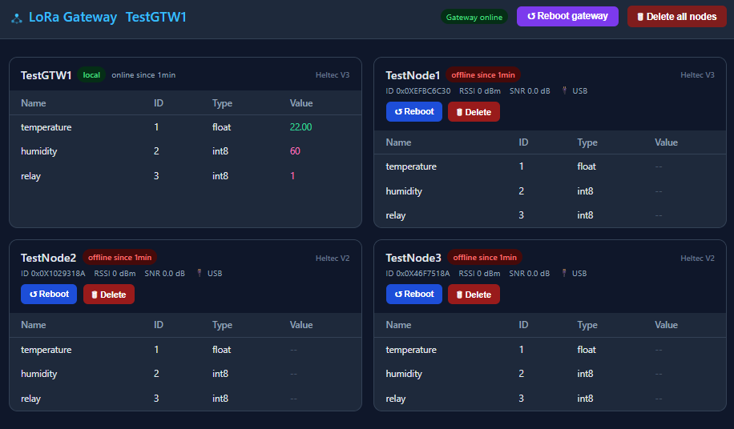

# LoRaDomo v1.2.0

LoRa home automation library

## 📚 Full Documentation

[Full Documentation](https://mizar03110.github.io/LoRaDomo/)

## Features

- Automatic node registration with gateway
- Sensor value publishing (int8, int32, float)
- Read callbacks: fetch fresh sensor value just before send
- Actuator callbacks: receive values from gateway/domotics controller
- Periodic send interval per sensor (or on-change only)
- Heartbeat with battery level and USB detection
- Battery read callback: plug in your ADC reading, works across all boards
- **Gateway local sensors**: add sensors directly on the gateway — published to MQTT and displayed in the web UI, no LoRa needed
- MQTT gateway with WebSocket UI
- Board name and uptime displayed in web UI
- NVS persistence of node/sensor registry (optimized — writes only on discovery)
- **Delete all nodes** button in web UI (clears NVS)
- Late-joining WebSocket clients receive current state immediately
- Debug mode (no code change needed)



## Dependencies

Install via Arduino Library Manager or PlatformIO:

- RadioHead
- PubSubClient
- WebSockets
- ArduinoJson

## Hardware


Supported boards — auto-detected from the IDE / PlatformIO board selection:

| Board | Radio | TX Power |
|-------|-------|----------|
| Heltec WiFi LoRa 32 V2 | SX1276 | 17 dBm |
| Heltec WiFi LoRa 32 V3 | SX1262 | 13 dBm |
| Heltec WiFi LoRa 32 V4 | SX1262 | 22 dBm |
| TTGO LoRa32 V1 | SX1276 | 17 dBm |

Select the correct board in your IDE — no code change needed. Manual override also supported (see [Installation](docs/installation.md)).

## Quick Start

### Gateway

```cpp
#include "LoRaGateway.h"

LoRaGateway gateway;

void setup() {
    Serial.begin(115200);
    gateway.begin(
        "home",
        "networkKey",
        "192.168.1.10",
        "user", "pass",
        "MyWifi", "pass",
        true
    );
}

void loop() { gateway.loop(); }
```

### Node

```cpp
#include "LoRaNode.h"

LoRaNode node;

float readTemperature() { return 21.5f; }

void setup() {
    Serial.begin(115200);
    node.begin("networkKey", "living_room", true);
    node.addSensor(1, TYPE_FLOAT, "temperature", 30,
                   nullptr, (void*)readTemperature);
}

void loop() { node.loop(); }
```
